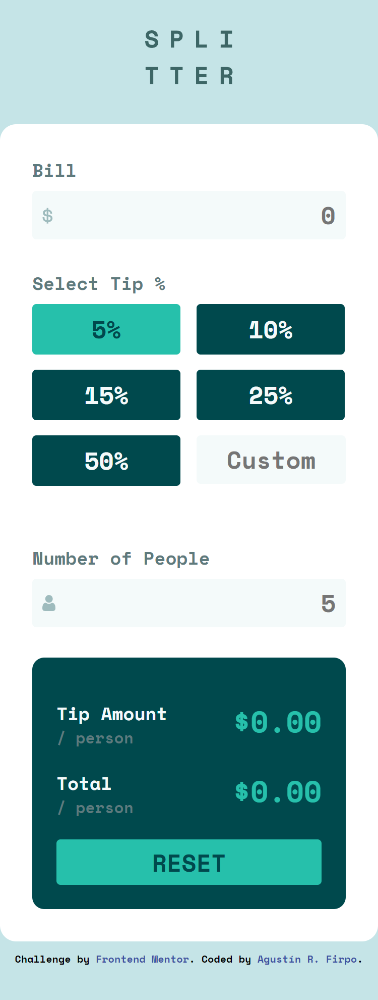
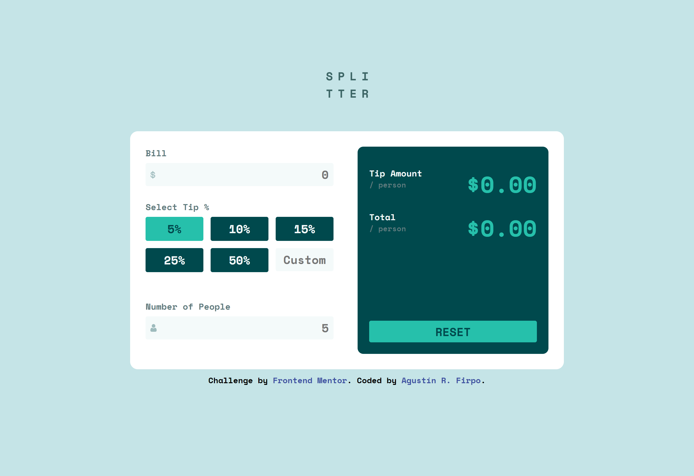

# Frontend Mentor - Tip calculator app solution

Hi everybody! 👋

This is a solution to the [Tip calculator app challenge on Frontend Mentor](https://www.frontendmentor.io/challenges/tip-calculator-app-ugJNGbJUX).

## Table of contents

- [Frontend Mentor - Tip calculator app solution](#frontend-mentor---tip-calculator-app-solution)
  - [Table of contents](#table-of-contents)
  - [Overview](#overview)
    - [The challenge](#the-challenge)
    - [Links](#links)
  - [My process](#my-process)
    - [Built with](#built-with)
    - [Author](#author)
## Overview

### The challenge

Users should be able to:

- View the optimal layout for the app depending on their device's screen size

Mobile Layout

Desktop Layout

Desktop Layout Complete

- See hover states for all interactive elements on the page

- Calculate the correct tip and total cost of the bill per person

### Links

- Solution: [Github Repository](https://github.com/Arfirpo/tip-calculator-app-main)
- Page: [Github Page](https://arfirpo.github.io/tip-calculator-app-main/)

## My process

### Built with

- Semantic HTML5 markup
- CSS custom properties
- Flexbox
- CSS Grid
- Mobile-first workflow
- [Sass](https://sass-lang.com/) - Css preprocessor
- Javascript

### Author

- Linkedin - [Agustín Rodrigo Firpo](https://www.linkedin.com/in/agustin-rodrigo-firpo-0aa86697/)
- Frontend Mentor - [@Arfirpo](https://www.frontendmentor.io/profile/Arfirpo)
- Twitter - [@agus_firpo](https://twitter.com/agus_firpo)